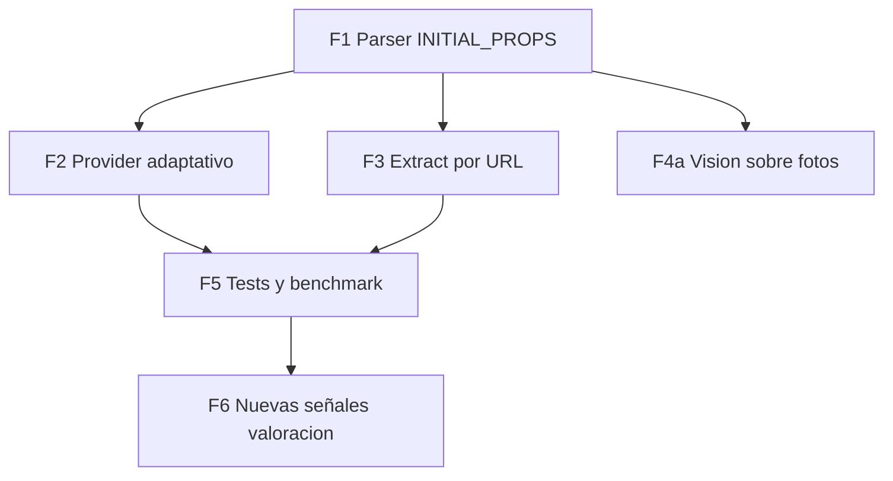

# Plan — Fichas individuales bloqueadas (405 antibot)

## Diagnóstico

Las páginas de anuncio (`*-covo.aspx`) están detrás de un challenge JS de **PerimeterX** (Adevinta). Sondeos realizados:

| Ruta / UA | Resultado |
|-----------|-----------|
| GET normal (Chrome UA) | `405` + página "Ups! Parece que algo no va bien" |
| GET con headers completos (Referer, Sec-Fetch-*, compressed) | `200` pero mismo HTML de challenge |
| `HEAD` | `200` con body vacío (no sirve) |
| UA móvil (iPhone) | `405` |
| UA Googlebot | `403` |
| `m.coches.net` | `301` → mismo bloqueo |
| URL corta `/{id}-covo.aspx` | `405` |

El challenge inyecta `<script src="/ztkieflaaxcvaiwh2" async defer>` (path aleatorio, firma de PerimeterX). **No se puede resolver sin ejecutar JS.**

Las páginas de **búsqueda** (`/{marca}/{modelo}/segunda-mano/...`) **no están bloqueadas**.

## Hallazgo que cambia el plan

Las páginas de búsqueda incluyen `window.__INITIAL_PROPS__` con un JSON completo de resultados:

```
window.__INITIAL_PROPS__ = JSON.parse("…")
  → initialResults.items[]        35 anuncios por página
  → initialResults.totalResults   p. ej. 2112 (BMW X1)
  → initialResults.totalPages     p. ej. 71
  → initialResults.aggregations   facets: makeId, model, fuelTypeIds, bodyTypeIds, provinceIds
```

Campos por anuncio (verificados en vivo):

| Campo | Ejemplo | Hoy lo tenemos |
|-------|---------|----------------|
| `id` | `"71004278"` | sí |
| `title` | `"BMW X1 sDrive18dA Business"` | sí (regex) |
| `price` | `35799` | sí |
| `km` | `30000` | sí (parseado de texto) |
| `year` | `2023` | sí |
| `hp` | `220` | sí |
| `fuelType` | `"Híbrido enchufable"` | sí |
| `bodyTypeId` | `6` | **no** |
| `publicationDate` | `"2026-08-02T15:47:05Z"` | **no** |
| `creationDate` | `"2026-07-06T13:48:14Z"` | **no** |
| `photos[]` | 11–54 URLs | **no** |
| `isProfessional` | `false` | parcial (regex texto) |
| `environmentalLabel` | `"0"` | **no** |
| `hasWarranty` | `false` | **no** |
| `isCertified` | `false` | **no** |
| `isFinanced` | `false` | **no** |
| `offerType` | `{id:0, literal:"Ocasión"}` | **no** |
| `location` | `{mainProvince:"Baleares", cityLiteral:"Eivissa"}` | parcial |
| `phone` | `"624410900"` | **no** |
| `videos` | `[]` | **no** |

### Impacto medido

| Métrica | Parser regex actual | `__INITIAL_PROPS__` |
|---------|---------------------|---------------------|
| Anuncios por página | ~7 | **35** (5×) |
| BMW X1 2019 diésel (121 totales) | 7/página → 6 págs para ~42 | **35/página → 4 págs para 121** |
| Campos estructurados | 9 (algunos por regex frágil) | **20+ tipados** |
| Fotos | 0 | 11–54 por anuncio |
| Días en mercado | no | sí (`publicationDate`) |

**Conclusión: no hay que romper el antibot.** Hay que dejar de parsear HTML con regex y leer el JSON de hidratación.

---

## Qué sigue faltando (solo está en la ficha bloqueada)

- Descripción libre del vendedor
- Lista completa de equipamiento
- Nº de propietarios, estado de ITV

Estos tres se abordan en la Fase 4, y **no** con Playwright como primera opción.

---

## Fase 1 — Parser de `__INITIAL_PROPS__`

**Objetivo:** sustituir el parseo por regex de cards por el JSON de hidratación, con regex como fallback.

### Archivos

- `lib/sources/coches-net/initial-props.ts` (nuevo)
  ```ts
  extractInitialProps(html: string): unknown | null
  parseSearchResults(html: string): {
    items: CochesNetApiAd[];
    totalResults: number;
    totalPages: number;
    aggregations?: CochesNetAggregation[];
  } | null
  ```
  Extracción: `window.__INITIAL_PROPS__ = JSON.parse("…")` → desescapar literal JS (`JSON.parse('"' + raw + '"')`) → `JSON.parse` del resultado.

- `lib/sources/coches-net/api-types.ts` (nuevo) — interfaz `CochesNetApiAd` con los campos de la tabla.

- `lib/sources/coches-net/parse.ts`
  - `parseSearchHtml` intenta primero `parseSearchResults`; si devuelve `null`, cae al parser regex actual.
  - `ParsedCochesNetAd` gana: `photos`, `publicationDate`, `creationDate`, `isProfessional`, `environmentalLabel`, `hasWarranty`, `isCertified`, `isFinanced`, `offerType`, `city`, `province`, `bodyTypeId`, `totalPhotos`.
  - Mapeo `fuelType` (literal español) → `FuelType` reutilizando `parseFuel`.
  - Mapeo `bodyTypeId` → `BodyType` (tabla nueva; los ids observados: `1`, `6`).

**Criterio de aceptación:** fixture de búsqueda → ≥30 anuncios con `price`, `km`, `year`, `hp` y `photos.length > 0`.

---

## Fase 2 — Provider: menos páginas, más datos

**Archivo:** `lib/sources/coches-net/provider.ts`

- Usar `totalResults` / `totalPages` del JSON para decidir cuántas páginas pedir, en vez de heurística fija:
  - Objetivo: ~40 anuncios en el núcleo (año+combustible) o agotar `totalPages`.
  - Con 35/página, **1–2 páginas** suelen bastar (hoy pedimos hasta 6).
- Menos peticiones ⇒ menos riesgo de rate limit ⇒ el fallo del caso E del benchmark (Clase A) debería desaparecer.
- `notes`: añadir `totalResults` del portal ("121 anuncios en coches.net para este filtro").
- **Eliminar** `enrichTopListingsWithDetail` (hoy hace 3 fetches a fichas que siempre dan 405). Sustituir por los datos del JSON.

**Criterio de aceptación:** benchmark con `pagesFetched ≤ 3` en los 5 casos y `listings` ≥ actual en todos.

---

## Fase 3 — Extract por URL sin ficha

**Archivo:** `lib/sources/coches-net/provider.ts` → `extractListing`

Hoy: parsea el slug, luego busca el ID en páginas de resultados (7 anuncios/página → falla a menudo; 2/5 en benchmark).

Nuevo flujo:

1. `parseListingUrl(url)` → marca, modelo, año, combustible, id.
2. Construir **URL de búsqueda filtrada** con esos datos (ya existe `buildSearchUrlFromQuery`).
3. Recorrer páginas leyendo el JSON, buscando coincidencia por **`id`** o por **`url`** (el JSON trae `url` del anuncio).
4. Con 35/página y filtro año+combustible, el universo suele ser <150 → **≤4 páginas** cubren el 100%.
5. Al encontrarlo: rellenar precio, km, CV, año, combustible, provincia/ciudad, fotos, fecha de publicación, profesional/particular.

Eliminar `fetchListingDetail` de esta ruta (siempre falla). Mantener el módulo pero marcarlo como no disponible.

**Criterio de aceptación:** ≥4/5 URLs del fixture con precio + km + CV (hoy 2/5).

---

## Fase 4 — Descripción y equipamiento (el hueco real)

Solo estos campos requieren la ficha bloqueada. Tres vías, **en este orden**:

### 4a. Visión sobre las fotos del JSON (recomendada)

Ahora tenemos 11–54 fotos por anuncio sin coste de scraping extra. Un modelo con visión puede extraer equipamiento observable (techo, navegador, tapicería, llantas, cuadro) mejor que el texto libre del vendedor, que además es poco fiable.

- Requiere modelo con visión (el actual `deepseek-v4-flash` no la tiene). AI Gateway permite enrutar solo esta llamada.
- Encaja con la feature de evaluación de fotos ya discutida.
- Coste acotado: 4–6 fotos del anuncio del usuario, no de los 35 comparables.

### 4b. Cookie de PerimeterX reutilizable

Obtener `_px3` / `_pxvid` una vez con navegador y reutilizarla en las peticiones. Barato pero frágil: caduca, se invalida por IP y es un juego del gato y el ratón.

- Solo si 4a no cubre lo necesario.
- Guardar en variable de entorno o KV con TTL; degradar silenciosamente al expirar.

### 4c. Navegador headless en worker aparte

Playwright con stealth **fuera de Vercel serverless** (Vercel Sandbox, contenedor propio o cola). Coste e infraestructura altos.

- Solo si el negocio exige la descripción completa.
- No entra en este plan salvo decisión explícita.

**Recomendación:** implementar 4a, documentar el hueco de descripción libre en la UI ("la ficha completa del anuncio no es accesible; usamos datos estructurados y fotos"), y no invertir en 4b/4c por ahora.

---

## Fase 5 — Tests, benchmark y limpieza

- **Fixtures**: capturar `search-page-1.html` fresca (con `__INITIAL_PROPS__` intacto; la actual está truncada a 450 KB y puede cortar el JSON). Guardar además `initial-props.json` extraído para test unitario ligero.
- **Tests nuevos** en `lib/sources/coches-net/__tests__/`:
  - `extractInitialProps` devuelve objeto con `initialResults.items.length === 35`
  - mapeo `CochesNetApiAd` → `VehicleListing` (combustible, carrocería, fotos)
  - fallback: HTML sin `__INITIAL_PROPS__` → usa regex y no lanza
  - `extractListing` con fixture encuentra el ID
- **Benchmark**: comparar contra `benchmarks/scraping-baseline.json`. Métricas esperadas:
  - `listings` ≥ actual en 5/5 casos
  - `coreCount` ≥ +100 % (de 35 raw/6 págs a 70 raw/2 págs)
  - `pagesFetched` ≤ 3
  - `extract` 4/5 con precio+km+CV
- **Limpieza**: `parse-listing.ts`, `structured.ts` y `fetch-listing-detail.ts` quedan sin uso en la ruta principal. Mantener para 4a/4b futuros, pero documentar que la ficha está bloqueada y que no se llama en el flujo normal (evita 3 fetches inútiles por análisis).

---

## Fase 6 — Aprovechar los datos nuevos

Con el JSON llegan señales que hoy no existen. Cambios de valoración y producto:

| Dato nuevo | Uso |
|------------|-----|
| `publicationDate` | **Días en mercado** → señal de negociación ("lleva 47 días publicado") |
| `isProfessional` | Segmentar mediana particular vs profesional (los profesionales piden más) |
| `hasWarranty`, `isCertified` | Ajuste de precio y `confidenceDrivers` |
| `environmentalLabel` | Filtro/aviso para ciudades con ZBE |
| `photos[]` | Galería en UI + evaluación con visión |
| `totalResults` | Contexto de mercado en `marketStatsDocument` |
| `location.cityLiteral` | Comparables por proximidad real |
| `aggregations` | "hay 121 con estos filtros de 2112 del modelo" |

**Archivos afectados:** `types/listing.ts`, `lib/sources/coches-net/map.ts`, `lib/valuation/engine.ts`, `lib/rag/documents.ts`, `components/comparable-cars/comparable-list.tsx`.

Esta fase puede ir en un PR separado para no mezclar el cambio de scraping con el de valoración.

---

## Riesgos

| Riesgo | Mitigación |
|--------|-----------|
| Cambian el nombre de la variable de hidratación | Fallback al parser regex actual (se mantiene); test que falla ruidosamente |
| Cambia la forma del JSON | Validar con Zod y degradar a regex si no valida |
| PerimeterX se extiende a páginas de búsqueda | Sería crítico; documentar plan B (Playwright en worker, 4c) sin implementarlo |
| Fixture truncada corta el JSON | Capturar sin truncar o guardar solo el JSON extraído |
| Rate limit al capturar fixtures | Reutilizar cache local (`data/catalog-cache/` ya lo hace para marcas) |

---

## Orden de ejecución y dependencias



**Ruta crítica:** F1 → F2/F3 → F5. F4a y F6 son PRs independientes posteriores.

## Alcance por PR

| PR | Contenido |
|----|-----------|
| **A** | F1 + F2 + F3 + F5 — parser JSON, provider, extract, tests, benchmark |
| **B** | F6 — señales nuevas en valoración, RAG y UI (galería, días en mercado) |
| **C** | F4a — visión sobre fotos (depende de decidir modelo con visión) |

## Definición de terminado (PR A)

- [ ] `npm run test:scraping` verde, incluidos tests de `initial-props`
- [ ] `npm run build` y `npm run lint` verdes
- [ ] Benchmark: `listings` ≥ baseline en 5/5, `pagesFetched` ≤ 3, extract ≥ 4/5
- [ ] Sin llamadas a fichas `*.aspx` en el flujo normal
- [ ] Fallback regex probado con HTML sin `__INITIAL_PROPS__`
- [ ] Nota en UI/limitaciones sobre la ficha completa no accesible
